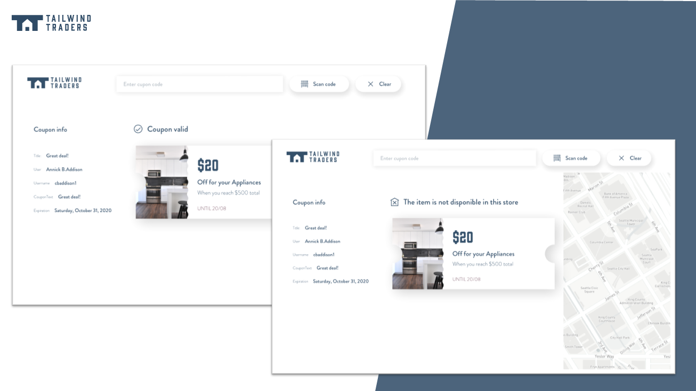

# Tailwind Traders Desktop Reference App

| DevOps | master                                                       | 
| ----------------- | ------------------------------------------------------------ |
| Windows           |  |

Download the latest release [here](https://tailwindtradersdesktop.blob.core.windows.net/release/tailwindtradersdesktop/TailwindTradersDesktop.zip ). 

# DemoScript

Check out the [Productivity Improvements in Visual Studio 2019](https://github.com/Microsoft/TailwindTraders/tree/master/Documents/DemoScripts/Productivity%20Improvements%20in%20Visual%20Studio%202019) demo script.

# Feedback
[Help us improving this reference application by providing us your valuable opinion](https://forms.office.com/Pages/ResponsePage.aspx?id=v4j5cvGGr0GRqy180BHbR8SMkUX-TIVBhIdeQCM_fI1UQzI4SDRIWFRGUU1aRkpDT1hDSUxKUFNRTyQlQCN0PWcu).

# Repositories

For this demo reference, we built several consumer and line-of-business applications and a set of backend services. You can find all repositories in the following locations:

* [Tailwind Traders](https://github.com/Microsoft/TailwindTraders)
* [Backend (AKS)](https://github.com/Microsoft/TailwindTraders-Backend)
* [Website (ASP.NET & React)](https://github.com/Microsoft/TailwindTraders-Website)
* [Desktop (WinForms & WPF -.NET Core)](https://github.com/Microsoft/TailwindTraders-Desktop)
* [Rewards (ASP.NET Framework)](https://github.com/Microsoft/TailwindTraders-Rewards)
* [Mobile (Xamarin Forms 4.0)](https://github.com/Microsoft/TailwindTraders-Mobile)

## PRISM
Prism is a framework for building loosely coupled, maintainable, and testable XAML applications in WPF, Windows 10 UWP, and Xamarin Forms.

Official Prism releases are available on NuGet. Simply add https://www.myget.org/F/prism/api/v3/index.json as a package source to either Visual Studio or Visual Studio for Mac.

These are the base packages for each platform, together with the Prism's Core assembly as a cross-platform PCL.

| Platform | Assembly | Package | NuGet |
| ----------- | ----------- | ---------- | ---------- |
| PCL | Prism.dll | [Prism.Core][CoreNuGet] | [![CoreNuGetShield]][CoreNuGet] | [![CoreMyGetShield]][CoreMyGet] |
| WPF | Prism.Wpf.dll | [Prism.Wpf][WpfNuGet] | [![WpfNuGetShield]][WpfNuGet] |
| DryIoc | Prism.DryIoc.dll | [Prism.DryIoc][DryIocWpfNuGet] | [![DryIocWpfNuGetShield]][DryIocWpfNuGet] |

## Xaml Islands
There are two new system APIs called [WindowsXamlManager](https://docs.microsoft.com/en-us/uwp/api/windows.ui.xaml.hosting.windowsxamlmanager) and [DesktopWindowXamlSource](https://docs.microsoft.com/en-us/uwp/api/windows.ui.xaml.hosting.desktopwindowxamlsource).

The WindowsXamlManager handles the UWP XAML Framework itself, which initializes the UWP XAML Framework inside the current thread of this non-UWP Win32 Desktop app, allowing it to create UWP UI in it.

The DesktopWindowXamlSource is the actual instance of your Island content. This class also enables the developer to get and set the focus of that element.

| NuGet | Description |
| ------------------------------------- | ------------------------------------------------------------------------- |
| [Microsoft.Toolkit.Wpf.UI.XamlHost](https://www.nuget.org/packages/Microsoft.Toolkit.Wpf.UI.XamlHost/) | This library provides XAML islands helpers for WPF. It is part of the Windows Community Toolkit.
|[Microsoft.Toolkit.Wpf.UI.Controls](https://www.nuget.org/packages/Microsoft.Toolkit.Wpf.UI.Controls/) | Wrapper classes for 1st party controls, InkCanvas, InkToolbar, MapControl, MediaPlayerElement, all for WPF. |

# Contributing

This project welcomes contributions and suggestions.  Most contributions require you to agree to a
Contributor License Agreement (CLA) declaring that you have the right to, and actually do, grant us
the rights to use your contribution. For details, visit https://cla.microsoft.com.

When you submit a pull request, a CLA-bot will automatically determine whether you need to provide
a CLA and decorate the PR appropriately (e.g., label, comment). Simply follow the instructions
provided by the bot. You will only need to do this once across all repos using our CLA.

This project has adopted the [Microsoft Open Source Code of Conduct](https://opensource.microsoft.com/codeofconduct/).
For more information see the [Code of Conduct FAQ](https://opensource.microsoft.com/codeofconduct/faq/) or
contact [opencode@microsoft.com](mailto:opencode@microsoft.com) with any additional questions or comments.

[CoreNuGet]: https://www.nuget.org/packages/Prism.Core/
[WpfNuGet]: https://www.nuget.org/packages/Prism.Wpf/
[CoreNuGetShield]: https://img.shields.io/nuget/vpre/Prism.Core.svg
[WpfNuGetShield]: https://img.shields.io/nuget/vpre/Prism.Wpf.svg
[DryIocWpfNuGetShield]: https://img.shields.io/nuget/vpre/Prism.DryIoc.svg
[CoreMyGetShield]: https://img.shields.io/myget/prism/vpre/Prism.Core.svg
[DryIocWpfMyGetShield]: https://img.shields.io/myget/prism/vpre/Prism.DryIoc.svg
[DryIocWpfNuGet]: https://www.nuget.org/packages/Prism.DryIoc/
